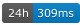
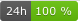
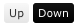
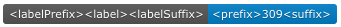
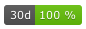
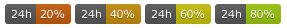
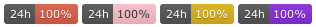
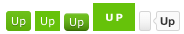
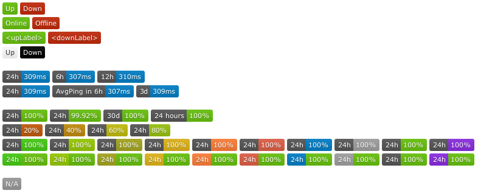

(Version >= 1.16.0)

- [Description](#description)
- [Status badge](#status-badge)
- [Ping and uptime badge](#ping-and-uptime-badge)
- [Screenshots](#screenshots)

# Description

Status, ping and uptime badges, generated in node-js, no internet access required (based on [badge-maker](https://www.npmjs.com/package/badge-maker) aka. [shields.io](http://shields.io/))

There are three API endpoints that return an SVG graphic for a given (public) monitor:

**Status** `<kuma-url>/api/badge/:monitorID/status` e.g. `<kuma-url>/api/badge/1/status` returning sth like: 

**Ping** `<kuma-url>/api/badge/:monitorID/ping/:duration` e.g. `<kuma-url>/api/badge/1/ping` returning sth like: 

**Uptime** `<kuma-url>/api/badge/:monitorID/uptime/:duration` e.g. `<kuma-url>/api/badge/1/uptime/24` returning sth like: 

# Status badge

There are options to customize the **status** badge's appearance: `upLabel = Up`, `downLabel = Down`, `upColor`, `downColor`:

`<kuma-url>/api/badge/<monitorId>/status?upLabel=<upLabel>&downLabel=<downLabel>` 

`<kuma-url>/api/badge/<monitorId>/status?upColor=white&downColor=black` 

# Ping and uptime badge

There are options to customize the **ping** and **uptime** badge's text: `labelPrefix`, `label`, `labelSuffix = h`, `prefix`, `suffix = ms / %`, `color`, `labelColor`:

`<kuma-url>/api/badge/<monitorId>/ping/24?labelPrefix=<labelPrefix>&label=<label>&labelSuffix=<labelSuffix>&prefix=<prefix>&suffix=<suffix>`

`<kuma-url>/api/badge/<monitorId>/uptime/24?labelPrefix=<labelPrefix>&label=<label>&labelSuffix=<labelSuffix>&prefix=<prefix>&suffix=<suffix>`

The given time interval has to be in 'hours', but customizing options allow for a different display: `<kuma-url>/api/badge/1/uptime/720?label=30&labelSuffix=d`

The default uptime badge's color is based on the uptime percentage:

but can be overwritten with predefined color or any other color in HEX code:

See https://shields.io/#colors for predefined colors.

Different badge styles as defined by https://shields.io/#styles are also supported. (thx @throwabird / [comment](https://github.com/louislam/uptime-kuma/pull/1119#issuecomment-1004760533) )

`<kuma-url>/api/badge/<monitorId>/status?style=flat-square`

Use of the following options to enable them: `flat` (default), `flat-square`, `plastic`, `for-the-badge`, `social`: 

# Screenshots

Source: https://github.com/louislam/uptime-kuma/pull/1119