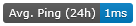
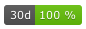
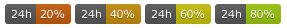
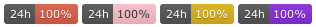
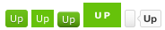
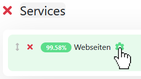
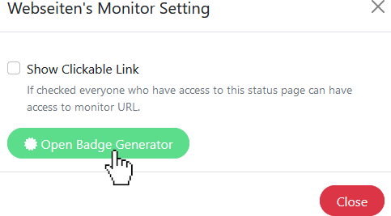
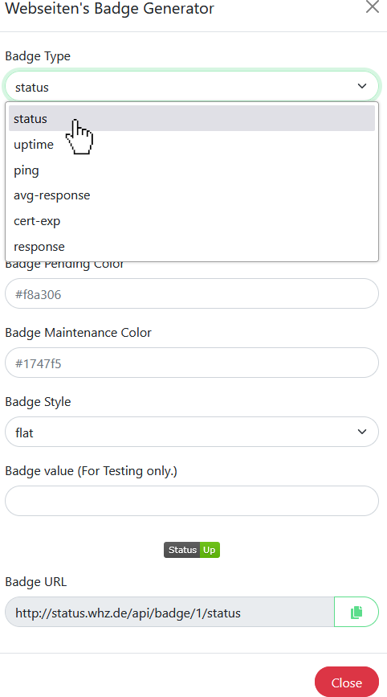
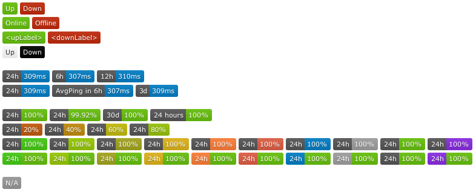

(Version >= 1.16.0)

- [Description](#description)
  - [Status badge](#status-badge)
  - [Ping, uptime and avg-response badge](#ping-uptime-and-avg-response-badge)
  - [Certificate Expire badge](#certificate-expire-badge)
  - [Response badge](#response-badge)
  - [Badge Styles](#badge-styles)
  - [Open Badge Generator](#open-badge-generator)
- [Screenshots](#screenshots)

# Description

`status`, `ping`, `uptime`, `avg-response`, `cert-exp` and `response`-badges are generated locally.
The server does this for all monitors which have been added to status pages and have thus been published.
The design is based on [badge-maker](https://www.npmjs.com/package/badge-maker) aka. [shields.io](http://shields.io/).

There are six API endpoints that return an SVG graphic for a given (public) monitor:

| Badge Type   | URL scheme                                            | URL example                         | Graphic example                              |
|--------------|-------------------------------------------------------|-------------------------------------|----------------------------------------------|
| status       | <kuma-url>/api/badge/:monitorID/status                | <kuma-url>/api/badge/1/status       |        |
| uptime       | <kuma-url>/api/badge/:monitorID/uptime:duration       | <kuma-url>/api/badge/1/uptime       |        |
| ping         | <kuma-url>/api/badge/:monitorID/ping:duration         | <kuma-url>/api/badge/1/ping         |          |
| avg-response | <kuma-url>/api/badge/:monitorID/avg-response:duration | <kuma-url>/api/badge/1/avg-response |  |
| cert-exp     | <kuma-url>/api/badge/:monitorID/cert-exp              | <kuma-url>/api/badge/1/cert-exp     |      |
| response     | <kuma-url>/api/badge/:monitorID/response              | <kuma-url>/api/badge/1/response     |      |

## Status badge

There are options to customize the **status** badge's appearance: `upLabel = Up`, `downLabel = Down`, `upColor`, `downColor`:

`<kuma-url>/api/badge/<monitorId>/status?upLabel=<upLabel>&downLabel=<downLabel>` 

`<kuma-url>/api/badge/<monitorId>/status?upColor=white&downColor=black` 

## Ping, uptime and avg-response badge

There are options to customize the **ping**, **uptime** and **avg-response** badge's text: `labelPrefix`, `label`, `labelSuffix = h`, `prefix`, `suffix = ms / %`, `color`, `labelColor`:

`<kuma-url>/api/badge/<monitorId>/ping/24?labelPrefix=<labelPrefix>&label=<label>&labelSuffix=<labelSuffix>&prefix=<prefix>&suffix=<suffix>`

`<kuma-url>/api/badge/<monitorId>/uptime/24?labelPrefix=<labelPrefix>&label=<label>&labelSuffix=<labelSuffix>&prefix=<prefix>&suffix=<suffix>`

`<kuma-url>/api/badge/<monitorId>/avg-response/24?labelPrefix=<labelPrefix>&label=<label>&labelSuffix=<labelSuffix>&prefix=<prefix>&suffix=<suffix>`

The given time interval at `Badge Duration (in hours)` has to be in 'hours', but customizing options allow for a different display: `<kuma-url>/api/badge/1/uptime/720?label=30&labelSuffix=d`

The default uptime badge's color is based on the uptime percentage:

but can be overwritten with predefined color or any other color in HEX code:

See https://www.npmjs.com/package/badge-maker#colors for predefined colors.

Different badge styles as defined by https://shields.io/#styles are also supported. (thx @throwabird / [comment](https://github.com/louislam/uptime-kuma/pull/1119#issuecomment-1004760533) )

`<kuma-url>/api/badge/<monitorId>/status?style=flat-square`

## Certificate Expire badge

There are options to customize the **cert-exp** badge's text: `labelPrefix`, `label`, `labelSuffix`, `prefix`, `suffix = days`, `color`, `labelColor`, `upColor`, `downColor`, `warnDays`, `downDays`:

## Response badge

There are options to customize the **response** badge's text: `labelPrefix`, `label`, `labelSuffix`, `prefix`, `suffix = ms / %`, `color`, `labelColor`:

## Badge Styles

Use of the following options to enable them: `flat` (default), `flat-square`, `plastic`, `for-the-badge`, `social`: 

## Open Badge Generator

Call up the Open Badge Generator of a service by pressing the Settings button on a status page in edit mode.

# Screenshots

Source: https://github.com/louislam/uptime-kuma/pull/1119