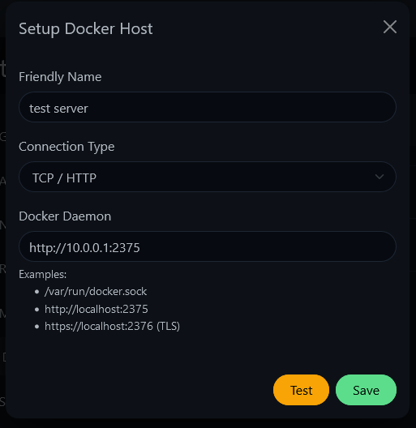

(Version >= 1.18.0)

## If you are running Uptime Kuma Docker

By default, a docker container is self-contained, which means Uptime Kuma cannot access your host. You need to bind the /var/run/docker.sock to your container.

### (Method 1) Share docker.sock with Uptime Kuma Container

Command argument:
```bash
-v /var/run/docker.sock:/var/run/docker.sock
```

docker-compose:

```yml
volumes:
   - /var/run/docker.sock:/var/run/docker.sock
```

### (Method 2) TCP - Bridge Mode

**Expose TCP port**  
To enable TCP monitoring, you need to first expose the Docker daemon on a TCP port. The primary documentation is available [here](https://docs.docker.com/config/daemon/) but the example below provides some quick options.

Update the daemon configuration located at `/etc/docker/daemon.json`:
```json
{
   #any additional parameters should be kept

   #Insecure option, only use this if you are running on a closed network
   "hosts": ["unix:///var/run/docker.sock", "tcp://<host IP address>:2375"]

   #Secure option
   "tls": true,
   "tlscert": "/var/docker/server.pem",
   "tlskey": "/var/docker/serverkey.pem",
   "hosts": ["unix:///var/run/docker.sock", "tcp://<host IP address>:2376"]
}
```

Restart the daemon using `sudo systemctl restart docker.service`.

If the daemon fails to start, it may be because there are duplicate keys, in this case hosts, -H, that is already part of the daemon configuration.

You can edit the startup configuration using `sudo systemctl edit docker.service`.

```toml
[Service]
#The blank ExecStart is required to clear the current entry point
ExecStart=
#Replace the existing ExecStart but only remove the properties that you have added into the daemon.json file, leave all else the same.
ExecStart=/usr/bin/dockerd --containerd=/run/containerd/containerd.sock
```

My original ExecStart was: `ExecStart=/usr/bin/dockerd -H fd:// --containerd=/run/containerd/containerd.sock`, note the -H that would cause a duplicate property error.


### Method 2 - If you installed docker using snap

Snap stores the `daemon.json` here:  `/var/snap/docker/current/config/daemon.json`

use `sudo nano /var/snap/docker/current/config/daemon.json` to edit the file like

```diff
{
    "log-level":        "error",
    "storage-driver":   "overlay2",
+   "hosts": ["unix:///var/run/docker.sock", "tcp://0.0.0.0:2375"]
}
```

- Restart the service: 
`sudo systemctl restart snap.docker.dockerd.service`

- Check if the service is running:
`sudo systemctl status snap.docker.dockerd.service`

The service should be running as usual, showing the docker snap service


**Update uptime-kuma**  
Add a new Docker host and choose TCP as the option. Specify the IP address of the host and the TCP port you exposed, as seen below.



## Related Disscussion

- https://github.com/louislam/uptime-kuma/issues/2061
