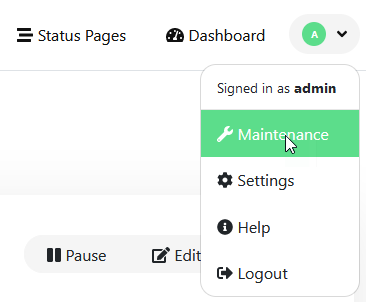
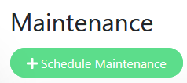

(Version >= 1.19.0)

# Description

This feature is designed for:

- Temporary disable notifications during a time window
- Show a maintenance message on status pages.

# Usage

You can access the maintenance management via the menu at the top left.

Within the maintenance management, there is an overview of the currently configured maintenance windows.
In the upper area, you can configure another maintenance using the '+ Schedule Maintenance' button.

## New Schedule Maintenance

**Title**

Here you can define an title for the new maintenance, witch is displayed on top of selected status pages.

**Description**

Here you can define an description for the new maintenance, witch is also displayed on top of selected status pages.
The description supports Markdown syntax.

**Affected Monitors**

Select the monitors that will be affected by the new maintenance.
These monitors will be displayed in blue on the Dashboard and all display status pages during the maintenance.

Select the affected monitors from the list. You can search by entering part of the title of the required monitor.

**Status Pages**

Display this maintenance message at the top of the selected status pages or select 'All Status Pages' to display the maintenance on all published status pages. You can select an affected status page from the list and search by typing part of the title of the required status page.

**Date and Time**

> **Strategy**
>
> - Active/Inactive Manually
> - Single Maintenance Window
> - Cron Expression
> - Recurring - Interval
> - Recurring - Day of Week
> - Recurring - Day of Month
> 
> **Timezone**
> 
> Select an special timezone of the maintenance or use the default option `Same as Server Timezone`.
> 
> **Start Date/Time**
>
> This input forces the following format: `DD.MM.YYYY HH:ii`
> 
> **End Date/Time**
>
> This input forces the following format: `DD.MM.YYYY HH:ii`