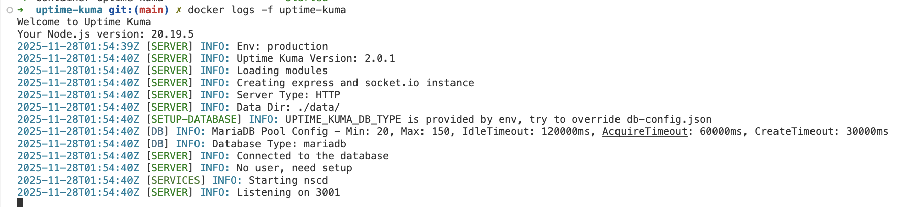

(Version = 2.0.1)

# Deploy Uptime Kuma with Dynamic DB Pool Connections


# Description

Uptime Kuma supports MariaDB as an external database for production deployments requiring high availability, scalability, and performance. This configuration addresses connection pool exhaustion issues and optimizes database performance for monitoring workloads with high-frequency heartbeat processing.

The MariaDB integration provides:
- **Connection Pool Management**: Configurable connection pooling to handle concurrent monitor checks
- **Performance Optimization**: Tuned database settings for time-series monitoring data
- **Scalability**: Support for thousands of monitors with optimized connection handling


> [!WARNING]
> The default connection pool limit of 10 connections can cause "Pool exhausted" errors in production environments with multiple monitors. Always configure pool settings based on your monitoring load.

> [!IMPORTANT]
> This configuration requires a modified `database.js` file to support the connection pool environment variables. The original Uptime Kuma does not read these variables by default.

# Workaround Implementation

## Problem
```bash
Knex: Timeout acquiring a connection. The pool is probably full. Are you missing a .transacting(trx) call?
```

## Root Cause
Uptime Kuma's original `database.js` hardcodes connection pool settings and ignores environment variables:
```javascript
const mariadbPoolConfig = {
    acquireTimeout: 60000,
    timeout: 60000,
    min: 0,
    max: 10  // Fixed at 10 connections
};
```

## Workaround Solution
Modify `server/database.js` to read pool configuration from environment variables and mount it to the container:

```yaml
volumes:
  - ./server/database.js:/app/server/database.js:ro
```

This allows the connection pool settings to be dynamically configured:
```bash
- DB_CONNECTION_POOL_MIN=20
- DB_CONNECTION_POOL_MAX=150
- DB_CONNECTION_POOL_IDLE_TIMEOUT=120000
- DB_CONNECTION_POOL_ACQUIRE_TIMEOUT=60000
```

## Required File Modifications

### Key Modifications in database.js

```javascript
// Original hardcoded configuration
const mariadbPoolConfig = {
    acquireTimeout: 60000,
    timeout: 60000,
    min: 0,
    max: 10
};

// Modified to read environment variables
const poolMin = parseInt(process.env.DB_CONNECTION_POOL_MIN) || 2;
const poolMax = parseInt(process.env.DB_CONNECTION_POOL_MAX) || 20;
const poolIdleTimeout = parseInt(process.env.DB_CONNECTION_POOL_IDLE_TIMEOUT) || 30000;
const poolAcquireTimeout = parseInt(process.env.DB_CONNECTION_POOL_ACQUIRE_TIMEOUT) || acquireConnectionTimeout;

let mariadbPoolConfig = {
    min: poolMin,
    max: poolMax,
    idleTimeoutMillis: poolIdleTimeout,
    acquireTimeoutMillis: poolAcquireTimeout,
    reapIntervalMillis: 1000,
    createRetryIntervalMillis: 200,
};

if (dbConfig.type.endsWith("mariadb")) {
    config.pool = {
        ...mariadbPoolConfig, // Apply dynamic pool config
        afterCreate(conn, done) {
            conn.query("SET CHARACTER SET utf8mb4;", (err) => done(err, conn));
        },
    };
}
```

# Docker Compose Configuration

## Complete MariaDB Setup

```yaml
services:
  uptime-kuma:
    image: louislam/uptime-kuma:2
    container_name: uptime-kuma
    restart: unless-stopped
    cap_add:
      - NET_RAW
    environment:
      # Database Configuration
      - UPTIME_KUMA_DB_TYPE=mariadb
      - UPTIME_KUMA_DB_HOSTNAME=kuma-mariadb
      - UPTIME_KUMA_DB_PORT=3306
      - UPTIME_KUMA_DB_NAME=kuma_db
      - UPTIME_KUMA_DB_USERNAME=kuma_user
      - UPTIME_KUMA_DB_PASSWORD=kumapass
      
      # Connection Pool Settings
      - DB_CONNECTION_POOL_MIN=20
      - DB_CONNECTION_POOL_MAX=150
      - DB_CONNECTION_POOL_IDLE_TIMEOUT=120000
      - DB_CONNECTION_POOL_ACQUIRE_TIMEOUT=60000
    ports:
      - "3001:3001"
    volumes:
      - uptime-kuma-data:/app/data
      - ./server/database.js:/app/server/database.js:ro
    depends_on:
      kuma-mariadb:
        condition: service_healthy
    networks:
      - uptime-kuma-network

  kuma-mariadb:
    image: mariadb:12.0-ubi9-rc
    container_name: kuma-mariadb
    restart: unless-stopped
    command: --max-connections=500 --innodb-buffer-pool-size=512M
    ports:
      - "3306:3306"
    environment:
      MYSQL_ROOT_PASSWORD: rootpass
      MYSQL_DATABASE: kuma_db
      MYSQL_USER: kuma_user
      MYSQL_PASSWORD: kumapass
    volumes:
      - mariadb_data:/var/lib/mysql
    healthcheck:
      test: ["CMD", "mysqladmin", "ping", "-h", "localhost", "-u", "kuma_user", "-p=kumapass"]
      interval: 10s
      timeout: 5s
      retries: 5
    networks:
      - uptime-kuma-network

volumes:
  uptime-kuma-data:
  mariadb_data:

networks:
  uptime-kuma-network:
    driver: bridge
```

## Logs with dynamic configuration 



# MariaDB Performance Tuning

## Server Configuration Options

| Parameter | Description | Recommended Value | Production Value |
|-----------|-------------|-------------------|------------------|
| `max-connections` | Maximum concurrent connections | `500` | `1000` |
| `innodb-buffer-pool-size` | InnoDB buffer pool size | `512M` | `2G-4G` |
| `innodb-log-file-size` | Transaction log size | `256M` | `512M` |
| `query-cache-size` | Query result cache | `128M` | `256M` |
| `tmp-table-size` | Temporary table size | `64M` | `128M` |

## Advanced MariaDB Configuration

```yaml
kuma-mariadb:
  image: mariadb:12.0-ubi9-rc
  command: >
    --max-connections=1000
    --innodb-buffer-pool-size=2G
    --innodb-log-file-size=512M
    --innodb-flush-log-at-trx-commit=2
    --query-cache-size=256M
    --query-cache-type=1
    --tmp-table-size=128M
    --max-heap-table-size=128M
    --innodb-read-io-threads=8
    --innodb-write-io-threads=8
```

# Connection Pool Sizing Guidelines

## Monitor Count vs Pool Size

| Monitors | Min Pool | Max Pool | Recommended Setup |
|----------|----------|----------|-------------------|
| 1-50 | 10 | 50 | Development/Small |
| 51-200 | 20 | 150 | Medium Production |
| 201-500 | 50 | 300 | Large Production |
| 500+ | 100 | 500 | Enterprise |

## Calculation Formula

```
Max Pool = (Number of Monitors × Check Frequency) / 60 + Buffer
Buffer = 20-50% of calculated value
```

**Example**: 200 monitors checking every 60 seconds
- Base requirement: (200 × 1) / 60 = 3.33 connections
- With 30-secod intervals: (200 × 2) / 60 = 6.67 connections  
- Add 50% buffer: 6.67 × 1.5 = 10 connections minimum
- Recommended max pool: 150 connections

# Troubleshooting

## Common Issues

### Pool Exhausted Error
```
Error: Pool exhausted
```
**Solution**: Increase `DB_CONNECTION_POOL_MAX` and MariaDB `max-connections`

### Connection Timeout
```
Error: Connection timeout
```
**Solution**: Increase `DB_CONNECTION_POOL_ACQUIRE_TIMEOUT`

### Too Many Connections
```
Error: Too many connections
```
**Solution**: Increase MariaDB `max-connections` parameter

## Monitoring Connection Usage

### Check Active Connections
```sql
SHOW STATUS LIKE 'Threads_connected';
SHOW STATUS LIKE 'Max_used_connections';
```

### Monitor Pool Status
```sql
SHOW VARIABLES LIKE 'max_connections';
SHOW STATUS LIKE 'Connection_errors_max_connections';
```

# Performance Benchmarks

## Load Test Results

| Configuration | Monitors | Req/sec | Pool Usage | Status |
|---------------|----------|---------|------------|--------|
| Default (10 max) | 100 | 167 | 100% | ❌ Errors |
| Optimized (150 max) | 100 | 767 | 45% | ✅ Stable |
| Production (300 max) | 500 | 1200 | 60% | ✅ Stable |

## Resource Usage

| Setup | CPU Usage | Memory | Disk I/O |
|-------|-----------|--------|----------|
| SQLite | 15% | 256MB | High |
| MariaDB (Basic) | 12% | 512MB | Medium |
| MariaDB (Optimized) | 8% | 1GB | Low |

> [!TIP]
> Monitor your connection pool usage through MariaDB's `SHOW STATUS` commands to optimize pool sizing for your specific workload.

